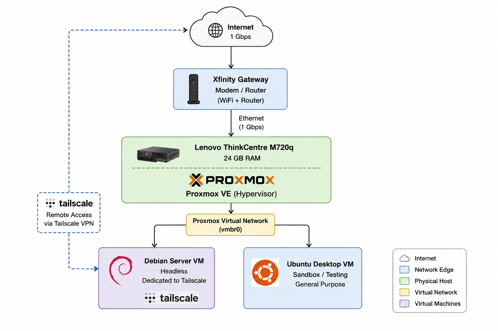

# Lab Architecture

This directory contains documentation and diagrams describing the physical and logical architecture of my homelab.

## Current Environment

# Lab Architecture

## Current Network Diagram

The diagram above represents the current architecture of my homelab.

The environment currently consists of a Lenovo ThinkCentre M720q running Proxmox VE with 24 GB of RAM. Proxmox hosts a headless Debian Server VM dedicated to Tailscale and an Ubuntu Desktop VM used as a sandbox and testing environment.

Remote access is currently provided through Tailscale.

## Components

- Proxmox virtualization host
- Virtual machines
- Local network
- Tailscale VPN
- Linux servers
- Self-hosted services

## Network Architecture

The network architecture will evolve as additional networking, security, and infrastructure components are added.

See `network-diagram.png` for the current network topology.

## Future Plans

Planned improvements include:

- VLAN segmentation
- Dedicated management network
- Server network
- Firewall implementation
- Network monitoring
- Additional virtualization hosts
- Centralized logging
- Automated infrastructure deployment
